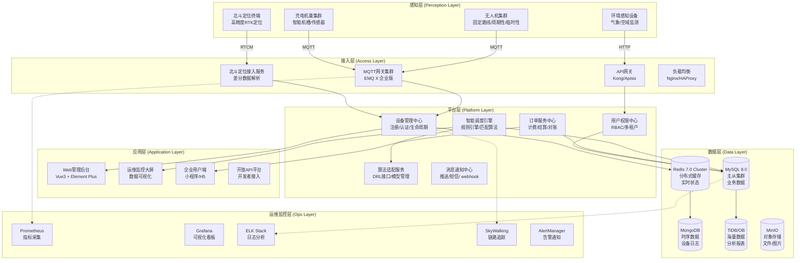
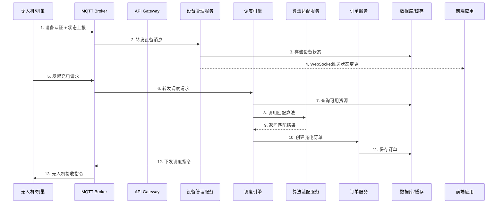
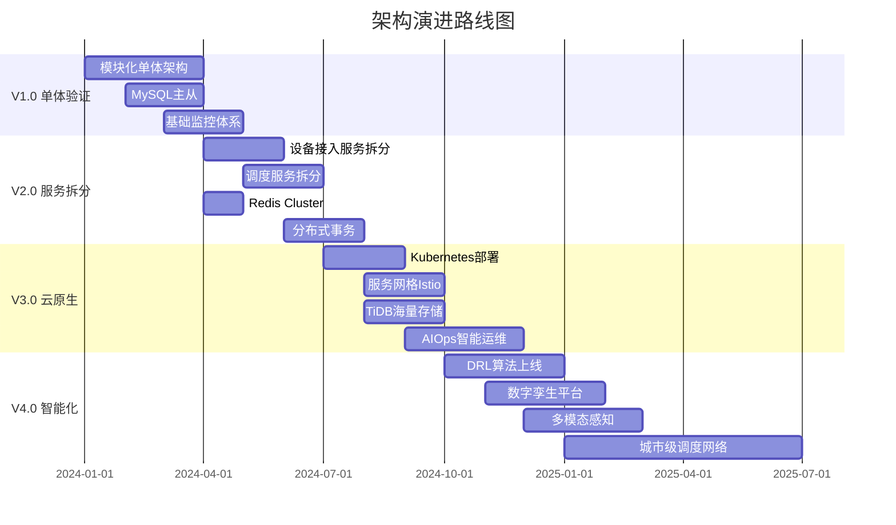

# 无人机共享充电机巢管理系统 - 整体架构设计

## 一、架构设计概述

### 1.1 设计目标

本系统面向中国低空经济场景，整合离散机槽资源为共享网络，通过智能调度解决无人机续航瓶颈，实现资源的共享化、调度智能化、管理数字化。

### 1.2 设计原则

| 原则 | 说明 |
|------|------|
| **安全合规** | 优先采用国产化技术栈，满足数据主权与合规要求 |
| **高可用性** | 关键组件采用集群部署，支持故障自动转移 |
| **可扩展性** | 微服务架构设计，支持水平扩展与功能迭代 |
| **实时性** | 毫秒级设备状态同步，秒级调度响应 |
| **开放性** | 预留算法接口，支持第三方系统对接 |

---

## 二、分层架构设计

### 2.1 总体架构图



### 2.2 各层职责说明

| 层级 | 核心职责 | 关键技术 |
|------|----------|----------|
| **感知层** | 设备数据采集、定位信息采集、环境感知 | 无人机飞控、机巢控制器、北斗RTK模块、传感器网络 |
| **接入层** | 设备接入协议适配、消息路由、负载均衡、安全防护 | EMQ X MQTT Broker、Kong API网关、Nginx负载均衡 |
| **平台层** | 核心业务逻辑处理、智能调度、算法集成、权限管理 | Spring Boot微服务、规则引擎、DRL算法接口 |
| **应用层** | 用户交互界面、数据可视化、移动应用、开放API | Vue3前端框架、Element Plus组件库、高德地图JS API |
| **数据层** | 结构化数据存储、缓存加速、时序数据、对象存储 | MySQL、Redis、MongoDB、TiDB、MinIO |
| **运维监控层** | 系统监控、日志分析、链路追踪、告警通知 | Prometheus、Grafana、ELK、SkyWalking |

---

## 三、核心组件与技术选型

### 3.1 技术栈全景图

```
┌─────────────────────────────────────────────────────────────────────────────┐
│                           技术栈全景图                                        │
├─────────────────────────────────────────────────────────────────────────────┤
│                                                                             │
│  ┌──────────────┐  ┌──────────────┐  ┌──────────────┐  ┌──────────────┐    │
│  │   前端技术    │  │   后端技术    │  │  数据存储    │  │   基础设施   │    │
│  ├──────────────┤  ├──────────────┤  ├──────────────┤  ├──────────────┤    │
│  │ • Vue3       │  │ • SpringBoot │  │ • MySQL 8.0  │  │ • Docker     │    │
│  │ • Vite       │  │ • SpringCloud│  │ • Redis 7.0  │  │ • K8s        │    │
│  │ • Pinia      │  │ • EMQ X      │  │ • MongoDB    │  │ • Nginx      │    │
│  │ • Vue-Router │  │ • RabbitMQ   │  │ • TiDB       │  │ • Harbor     │    │
│  │ • Axios      │  │ • Seata      │  │ • MinIO      │  │ • Jenkins    │    │
│  │ • Element+   │  │ • Sentinel   │  │              │  │              │    │
│  │ • ECharts    │  │ • Nacos      │  │              │  │              │    │
│  │ • 高德JS API │  │              │  │              │  │              │    │
│  └──────────────┘  └──────────────┘  └──────────────┘  └──────────────┘    │
│                                                                             │
└─────────────────────────────────────────────────────────────────────────────┘
```

### 3.2 各层组件详细说明

#### 3.2.1 感知层组件

| 组件名称 | 功能描述 | 技术规格 |
|----------|----------|----------|
| **无人机飞控系统** | 飞行控制、任务执行、状态上报 | 支持MAVLink协议，4G/5G通信 |
| **智能充电机巢** | 无人机自动起降、电池更换、充电管理 | 支持多槽位充电，单槽1500W+功率 |
| **北斗定位终端** | 高精度定位、差分数据接收 | RTK定位精度厘米级，支持BDS/GPS双模 |
| **环境感知传感器** | 气象监测、空域感知、障碍物检测 | 温度/湿度/风速/PM2.5传感器 |

#### 3.2.2 接入层组件

| 组件名称 | 选型 | 功能描述 | 部署方式 |
|----------|------|----------|----------|
| **MQTT Broker** | EMQ X 企业版(国内版) | 设备消息接入、协议转换、消息路由 | 集群部署(3节点) |
| **API网关** | Kong 或 Apache APISIX | 请求路由、鉴权、限流、协议转换 | 主备部署 |
| **负载均衡** | Nginx + Keepalived | 流量分发、健康检查、故障转移 | 主备部署 |
| **北斗接入服务** | 自研服务 | 差分数据解析、坐标转换、位置服务 | 双活部署 |

#### 3.2.3 平台层微服务

| 服务名称 | 职责 | 技术栈 | 关键特性 |
|----------|------|--------|----------|
| **设备管理服务** | 设备注册、认证、生命周期管理 | Spring Boot + MyBatis-Plus | 百万级设备接入 |
| **智能调度引擎** | 充电调度、资源匹配、策略执行 | Spring Boot + Drools规则引擎 | 秒级调度响应 |
| **订单服务中心** | 订单全生命周期、计费结算 | Spring Boot + Seata分布式事务 | 高并发订单处理 |
| **用户权限中心** | 用户管理、RBAC权限、多租户 | Spring Boot + Sa-Token | 企业级权限管控 |
| **算法适配服务** | DRL算法接口、模型管理、A/B测试 | Spring Boot + Python桥接 | 算法热插拔 |
| **消息通知中心** | 推送、短信、邮件、Webhook | Spring Boot + 阿里云SDK | 多渠道触达 |

#### 3.2.4 应用层组件

| 应用名称 | 技术栈 | 核心功能 |
|----------|--------|----------|
| **Web管理后台** | Vue3 + Vite + Pinia + Element Plus | 系统配置、设备管理、调度监控 |
| **运维监控大屏** | Vue3 + ECharts + DataV | 实时数据可视化、告警展示 |
| **企业用户端** | 微信小程序 + Taro/Vue3 | 订单管理、费用查询、设备绑定 |
| **开放API平台** | Spring Cloud Gateway + Swagger | 开发者接入、API文档、SDK下载 |

#### 3.2.5 数据层组件

| 存储类型 | 选型 | 用途 | 部署架构 |
|----------|------|------|----------|
| **关系型数据库** | MySQL 8.0 (主从+读写分离) | 业务数据、事务数据 | 一主两从+MGR |
| **分布式缓存** | Redis 7.0 Cluster | 会话缓存、热点数据、实时状态 | 三主三从 |
| **时序数据库** | MongoDB / TDengine | 设备日志、轨迹数据、传感器数据 | 分片集群 |
| **分析型数据库** | TiDB / OceanBase | 海量数据分析、报表查询 | 分布式集群 |
| **对象存储** | MinIO / 阿里云OSS | 文件、图片、视频、备份 | 高可用集群 |

#### 3.2.6 运维监控组件

| 组件 | 选型 | 功能 | 备注 |
|------|------|------|------|
| **指标采集** | Prometheus | 系统指标、业务指标采集 | 联邦集群部署 |
| **可视化** | Grafana | 监控大盘、告警视图 | 国产镜像部署 |
| **日志分析** | ELK Stack (国产版) | 日志采集、检索、分析 | 冷热数据分离 |
| **链路追踪** | SkyWalking | 分布式链路追踪、性能分析 | 支持国产组件 |
| **告警通知** | AlertManager | 告警收敛、分级、通知 | 多渠道推送 |

---

## 四、服务间通信与数据流

### 4.1 通信架构图



### 4.2 通信方式详解

#### 4.2.1 设备接入通信

| 通信方式 | 协议 | 场景 | 特点 |
|----------|------|------|------|
| **设备上行** | MQTT 3.1/3.1.1 | 状态上报、告警上报 | 轻量级、发布订阅、QoS保障 |
| **设备下行** | MQTT | 指令下发、配置更新 | 实时推送、低延迟 |
| **文件传输** | HTTP/HTTPS | 固件升级、日志上传 | 断点续传、完整性校验 |
| **定位数据** | NTRIP/RTCM | 北斗差分数据 | 高精度、低延迟 |

#### 4.2.2 服务间通信

| 通信方式 | 技术选型 | 应用场景 | 设计考虑 |
|----------|----------|----------|----------|
| **同步调用** | OpenFeign + Ribbon | 实时查询、强一致性业务 | 熔断降级、超时控制 |
| **异步消息** | RabbitMQ | 削峰填谷、最终一致性 | 消息持久化、死信队列 |
| **事件驱动** | Spring Cloud Stream | 领域事件传播 | 事件溯源、CQRS模式 |
| **服务网格** | Istio (可选) | 微服务治理 | 流量管理、安全通信 |

#### 4.2.3 前端通信

| 通信方式 | 技术实现 | 应用场景 |
|----------|----------|----------|
| **HTTP REST** | Axios | 常规API请求 |
| **WebSocket** | SockJS + STOMP | 实时状态推送、GIS更新 |
| **Server-Sent Events** | EventSource | 单向实时数据流 |
| **GraphQL** | Apollo Client (可选) | 复杂数据查询 |

### 4.3 核心数据流

#### 4.3.1 设备状态数据流

```
[设备] → MQTT → [EMQ X] → [设备管理服务] → Redis(实时状态)
                                   ↓
                              MySQL(持久化)
                                   ↓
                         WebSocket → [前端GIS]
```

#### 4.3.2 调度决策数据流

```
[充电请求] → [调度引擎] → 查询[Redis/DB]获取资源
                              ↓
                    [算法适配服务] → 调用[DRL算法]
                              ↓
                    [规则引擎] → 执行调度策略
                              ↓
              创建订单 → 下发指令 → 更新状态
```

#### 4.3.3 定位数据流

```
[北斗卫星] → [北斗地基增强站] → [RTCM差分数据]
                                     ↓
[无人机/机巢终端] ← 差分解算 ← [北斗接入服务]
                                     ↓
                            [坐标转换服务]
                                     ↓
                          [GIS服务/高德地图]
```

---

## 五、关键架构决策

### 5.1 决策矩阵

| 决策点 | 可选方案 | 选定方案 | 决策理由 |
|--------|----------|----------|----------|
| **设备接入协议** | MQTT / CoAP / HTTP | **MQTT** | 轻量级、发布订阅模式适配多对多场景，EMQ X国内生态成熟 |
| **微服务框架** | Spring Cloud / Dubbo / 自研 | **Spring Cloud Alibaba** | 国内技术栈、Nacos服务治理、Sentinel熔断、Seata分布式事务 |
| **数据库选型** | MySQL / PostgreSQL / TiDB | **MySQL 8.0 + TiDB** | MySQL满足OLTP，TiDB处理海量分析数据，兼容MySQL协议 |
| **缓存方案** | Redis / Memcached / Tair | **Redis Cluster** | 丰富的数据结构、持久化、集群模式高可用，国内云厂商支持好 |
| **地图服务** | 高德 / 百度 / 天地图 | **高德地图JS API** | API文档完善、低空数据丰富、与北斗定位兼容性好 |
| **消息队列** | RabbitMQ / RocketMQ / Kafka | **RabbitMQ + RocketMQ** | RabbitMQ解耦异步任务，RocketMQ处理海量设备消息 |
| **容器编排** | Kubernetes / Swarm / 自研 | **阿里云ACK** | 托管K8s减少运维成本，国内节点合规，自动扩缩容 |

### 5.2 关键决策详解

#### 5.2.1 为什么选择微服务而非单体架构？

**决策理由**：
1. **团队规模适配**：项目涉及设备接入、调度算法、GIS可视化等多个技术域，微服务支持团队并行开发
2. **异构技术需求**：调度算法需要Python生态（PyTorch/TensorFlow），与Java微服务通过gRPC/HTTP交互
3. **独立扩缩容**：设备接入服务需要高并发处理，可独立扩容；后台管理服务访问频率低，减少资源占用
4. **故障隔离**：单个服务故障不影响整体系统，提升可用性

**初期妥协**：
- V1.0阶段采用"模块化单体"快速验证业务逻辑
- V2.0阶段按服务边界拆分，优先拆分设备接入服务、调度服务

#### 5.2.2 为什么选择EMQ X而非自建MQTT Broker？

**决策理由**：
1. **海量连接支持**：单机支持百万级并发连接，集群模式可横向扩展至千万级
2. **企业级特性**：内置ACL权限控制、消息持久化、数据桥接（可直接写入数据库）、规则引擎
3. **国内支持**：杭州映云科技出品，提供中文技术支持、符合国内合规要求
4. **生态集成**：与Redis、MySQL、Kafka等国内常用组件有官方插件支持

**部署架构**：
- 生产环境：3节点EMQ X集群 + 1节点负载均衡（HAProxy）
- 使用规则引擎实现：设备消息→Redis实时状态更新 + MySQL持久化

#### 5.2.3 为什么选择Redis Cluster而非单节点Redis？

**决策理由**：
1. **数据容量**：单机Redis受内存限制（通常<64GB），集群模式可扩展至TB级
2. **高可用性**：主从复制+哨兵监控，主节点故障自动故障转移（<30秒）
3. **性能线性扩展**：16384个哈希槽均匀分布，新增节点自动重新分片
4. **数据安全**：支持AOF+RDB持久化，防止数据丢失

**使用场景划分**：
| 数据类型 | Redis数据结构 | 用途 | TTL |
|----------|---------------|------|-----|
| 设备在线状态 | Hash | 实时状态查询 | 300s |
| 机巢占用状态 | String | 并发控制 | 动态 |
| 用户会话 | String | 登录状态 | 7200s |
| 热点数据 | String | 接口缓存 | 300s |
| 限流计数 | String | 接口限流 | 60s |
| 地理位置 | Geo | 附近机巢查询 | 动态 |
| 消息队列 | List/Stream | 异步任务 | 持久化 |

### 5.3 架构演进路线



---

## 六、潜在技术风险与应对策略

### 6.1 风险矩阵

| 风险等级 | 风险项 | 风险描述 | 发生概率 | 影响程度 | 应对策略 |
|----------|--------|----------|----------|----------|----------|
| 🔴 高 | 设备大规模离线 | 网络故障或设备故障导致大量设备同时离线 | 中 | 极高 | 本地缓存策略、断点续传、降级服务 |
| 🔴 高 | 调度系统雪崩 | 高并发场景下调度服务响应超时引发连锁故障 | 中 | 极高 | 熔断降级、限流、异步队列、缓存预热 |
| 🟡 中 | 数据库性能瓶颈 | 海量设备数据写入导致数据库性能下降 | 高 | 高 | 读写分离、分库分表、TiDB分布式存储 |
| 🟡 中 | Redis缓存穿透 | 大量请求查询不存在的数据导致数据库压力 | 中 | 中 | 布隆过滤器、缓存空值、热点数据预加载 |
| 🟡 中 | 北斗定位精度漂移 | 复杂环境下定位精度下降影响调度准确性 | 中 | 高 | 多源融合定位、卡尔曼滤波、RTK增强 |
| 🟢 低 | 算法服务异常 | DRL算法服务故障导致智能调度失效 | 低 | 高 | 规则引擎兜底、贪心算法备用、灰度发布 |
| 🟢 低 | 数据安全风险 | 设备数据泄露或被篡改 | 低 | 极高 | 传输加密、设备认证、访问审计、数据脱敏 |

### 6.2 核心风险应对详解

#### 6.2.1 设备大规模离线风险

**风险场景**：
- 运营商网络故障导致数万设备同时断连
- 区域性电力中断导致机巢集群离线
- MQTT Broker集群故障导致设备无法接入

**应对策略**：

1. **设备端本地缓存**
```java
// 设备端本地队列实现
public class LocalMessageQueue {
    private final Queue<DeviceMessage> offlineQueue = 
        new LinkedBlockingQueue<>(1000);
    
    public void onNetworkDisconnect() {
        // 网络断开时，消息入本地队列
        switchToOfflineMode();
    }
    
    public void onNetworkReconnect() {
        // 网络恢复后，批量同步离线消息
        batchSync(offlineQueue);
    }
}
```

2. **服务端断点续传**
```java
// 服务端实现消息持久化与重放
@Service
public class MessageReplayService {
    
    @KafkaListener(topics = "device-messages")
    public void persistMessage(DeviceMessage message) {
        // 消息持久化到数据库
        messageRepository.save(message);
        
        // 推送至Redis Stream供实时处理
        redisTemplate.opsForStream().add("device:stream", message.toMap());
    }
    
    public List<DeviceMessage> replayMessages(String deviceId, long lastSeq) {
        // 根据设备最后确认的序列号重放消息
        return messageRepository.findByDeviceIdAndSeqGreaterThan(deviceId, lastSeq);
    }
}
```

3. **多级降级策略**

```yaml
# 降级策略配置
degrade:
  levels:
    level-1: # 轻度降级 - 部分功能受限
      conditions:
        - offline_ratio > 10%
      actions:
        - disable_realtime_analytics
        - reduce_log_level
    
    level-2: # 中度降级 - 核心功能保障
      conditions:
        - offline_ratio > 30%
      actions:
        - enable_local_cache_mode
        - disable_auto_dispatch
        - manual_confirm