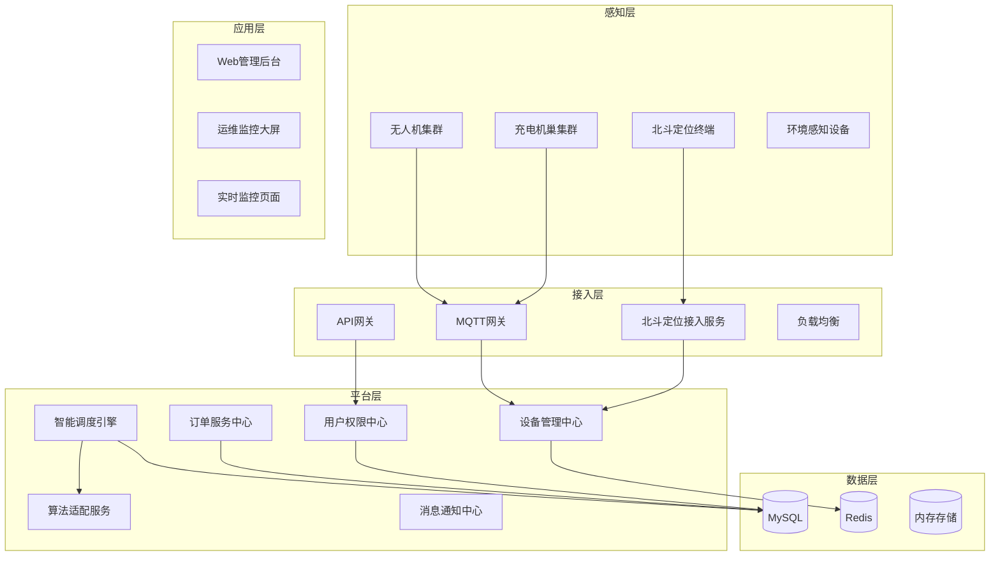

# 无人机共享充电机巢管理系统 - 项目说明文档

---

## 一、项目概述

### 1.1 项目背景
随着中国低空经济的快速发展，无人机应用场景日益丰富，但传统非共享机槽模式存在资源利用率低、无人机续航不足、运营成本高等问题，制约了低空经济规模化发展。本项目旨在搭建一套面向中国低空经济场景的无人机共享机槽管理系统，整合离散机槽资源为共享网络，通过智能调度破解续航瓶颈。

### 1.2 项目目标
1. 基于高德 GIS 地图与北斗定位，实时呈现机槽位置、在线状态、占用情况及使用时长；
2. 支持三类无人机（固定路线、周期性、临时性）的差异化充电调度，集成深度图强化学习算法；
3. 实现多维度历史数据查询（机槽利用率、充电订单、调度记录）；
4. 构建稳定可靠的前后端架构，满足高并发场景下的调度需求；
5. 优先采用国内技术栈，保障系统安全性与合规性。

### 1.3 核心价值
| 价值维度 | 描述 |
|---------|------|
| **资源共享** | 整合离散机巢资源，提升设备利用率 |
| **智能调度** | GAT+PPO算法实现全局最优匹配 |
| **实时监控** | 毫秒级设备状态同步，秒级调度响应 |
| **数据驱动** | 多维度统计分析，辅助决策优化 |

---

## 二、系统架构设计

### 2.1 分层架构



### 2.2 技术栈选型

| 层级 | 技术 | 版本 | 选型理由 |
|------|------|------|----------|
| **前端框架** | Vue3 | 3.2+ | 国内生态成熟，性能优异 |
| **构建工具** | Vite | 4.2+ | 快速开发构建 |
| **状态管理** | Pinia | 2.0+ | Vue3官方状态管理 |
| **UI组件** | Element Plus | 2.3+ | 丰富组件库，中文支持好 |
| **图表库** | ECharts | 5.4+ | 强大的数据可视化能力 |
| **地图服务** | 高德地图JS API | - | 国内地图服务，低空数据丰富 |
| **后端框架** | Express | 4.18+ | 轻量级、高性能 |
| **数据库** | MySQL | 8.0+ | 成熟稳定，事务支持完善 |
| **缓存** | Redis | 7.0+ | 实时状态缓存，提升性能 |
| **消息协议** | WebSocket | - | 实时双向通信 |
| **认证** | JWT | - | 无状态认证，易于扩展 |
| **算法框架** | PyTorch | - | 深度学习模型训练与推理 |
| **图神经网络** | PyTorch Geometric | - | GAT图注意力网络支持 |

### 2.3 模块划分

| 模块 | 职责说明 | 状态 |
|------|----------|------|
| **设备管理** | 无人机/机巢注册、认证、状态管理 | 已完成 |
| **充电管理** | 充电流程监控、功率统计、状态同步 | 已完成 |
| **订单管理** | 订单创建、计费、状态流转 | 已完成 |
| **智能调度** | GAT+PPO算法匹配、任务调度 | 已完成 |
| **实时监控** | WebSocket实时推送、状态展示 | 已完成 |
| **告警管理** | 异常检测、告警通知、故障处理 | 已完成 |
| **数据统计** | 多维度报表、趋势分析 | 已完成 |

---

## 三、前端系统设计

### 3.1 目录结构

```
drone-nest-management/
├── public/              # 静态资源
├── src/
│   ├── api/             # API接口封装
│   │   ├── alert.js     # 告警API
│   │   ├── booking.js   # 预约API
│   │   ├── charging.js  # 充电API
│   │   ├── drone.js     # 无人机API
│   │   ├── nest.js      # 机巢API
│   │   ├── order.js     # 订单API
│   │   ├── scheduling.js # 调度API
│   │   ├── statistics.js # 统计API
│   │   ├── user.js      # 用户API
│   │   └── request.js   # 请求封装
│   ├── components/      # 公共组件
│   │   └── Map3D.vue    # 3D地图组件
│   ├── router/          # 路由配置
│   │   └── index.js
│   ├── store/           # Pinia状态管理
│   │   ├── alert.js     # 告警状态
│   │   ├── charging.js  # 充电状态
│   │   ├── dataSync.js  # 数据同步
│   │   ├── drone.js     # 无人机状态
│   │   ├── nest.js      # 机巢状态
│   │   ├── order.js     # 订单状态
│   │   ├── realtime.js  # 实时状态
│   │   ├── statistics.js # 统计数据
│   │   └── user.js      # 用户状态
│   ├── styles/          # 全局样式
│   │   ├── global.scss
│   │   └── variables.scss
│   ├── utils/           # 工具函数
│   │   ├── amap.js      # 高德地图工具
│   │   ├── coordinateTransformer.js # 坐标转换
│   │   ├── index.js
│   │   └── websocket.js # WebSocket封装
│   ├── views/           # 页面组件
│   │   ├── Alerts.vue   # 告警管理页
│   │   ├── Booking.vue  # 预约调度页
│   │   ├── Charging.vue # 充电管理页
│   │   ├── Dashboard.vue # 数据概览页
│   │   ├── Drones.vue   # 无人机管理页
│   │   ├── Layout.vue   # 布局页
│   │   ├── Login.vue    # 登录页
│   │   ├── Monitor.vue  # 实时监控页
│   │   ├── Nests.vue    # 机巢管理页
│   │   ├── NotFound.vue # 404页
│   │   ├── Orders.vue   # 订单管理页
│   │   ├── Register.vue # 注册页
│   │   ├── Scheduling.vue # 智能调度页
│   │   ├── Settings.vue # 系统设置页
│   │   └── Statistics.vue # 数据统计页
│   ├── App.vue          # 根组件
│   └── main.js          # 入口文件
├── .env.example        # 环境变量模板
├── Dockerfile          # Docker配置
├── index.html          # HTML模板
├── nginx.conf          # Nginx配置
├── package.json        # 依赖配置
└── vite.config.js      # Vite配置
```

### 3.2 核心页面功能

#### 3.2.1 数据概览页 (Dashboard)
- 全网机巢在线率统计
- 当前充电订单数
- 告警数量汇总
- 机巢利用率趋势图

#### 3.2.2 实时监控页 (Monitor)
- 高德地图展示机巢分布
- 机巢状态实时更新（在线/离线/空闲/占用）
- 无人机实时位置追踪
- 充电进度可视化

#### 3.2.3 无人机管理页 (Drones)
- 无人机列表展示
- 无人机信息编辑
- 绑定/解绑机巢
- 按类型筛选（固定路线/周期性/临时性）

#### 3.2.4 机巢管理页 (Nests)
- 机巢列表展示
- 机巢详情查看
- 槽位状态管理
- 地理位置信息

#### 3.2.5 智能调度页 (Scheduling)
- 调度任务创建
- 算法选择（GAT-PPO/贪心算法）
- 调度结果展示
- 调度器状态控制

#### 3.2.6 充电管理页 (Charging)
- 实时充电状态
- 功率统计图表
- 充电历史记录
- 充电异常处理

#### 3.2.7 订单管理页 (Orders)
- 订单列表展示
- 订单状态跟踪
- 费用明细查看
- 订单导出功能

#### 3.2.8 告警管理页 (Alerts)
- 告警列表展示
- 告警级别筛选
- 告警处理记录
- 告警通知设置

#### 3.2.9 数据统计页 (Statistics)
- 机巢利用率趋势
- 充电订单统计
- 调度效率分析
- 多维度报表

### 3.3 前端核心技术实现

#### 3.3.1 状态管理架构
```
┌─────────────────────────────────────────────────────────────┐
│                      Pinia Store                           │
├─────────────────────────────────────────────────────────────┤
│  user          ── 用户认证状态、权限信息                    │
│  drone         ── 无人机列表、状态、位置                    │
│  nest          ── 机巢列表、状态、槽位信息                  │
│  order         ── 订单列表、状态、费用                      │
│  charging      ── 充电状态、功率、进度                      │
│  alert         ── 告警列表、级别、处理状态                  │
│  statistics    ── 统计数据、图表数据                        │
│  realtime      ── WebSocket连接状态、实时数据               │
│  dataSync      ── 数据同步状态、缓存管理                    │
└─────────────────────────────────────────────────────────────┘
```

#### 3.3.2 API接口封装
```javascript
// 请求拦截器 - 添加Token
axios.interceptors.request.use(config => {
  const token = localStorage.getItem('token')
  if (token) {
    config.headers.Authorization = `Bearer ${token}`
  }
  return config
})

// 响应拦截器 - 统一错误处理
axios.interceptors.response.use(
  response => response.data,
  error => {
    if (error.response?.status === 401) {
      router.push('/login')
    }
    return Promise.reject(error)
  }
)
```

#### 3.3.3 WebSocket实时通信
```javascript
// 连接建立
const ws = new WebSocket(`ws://${host}/ws`)

// 消息接收
ws.onmessage = (event) => {
  const data = JSON.parse(event.data)
  switch (data.type) {
    case 'drone_update':
      updateDroneState(data.payload)
      break
    case 'nest_update':
      updateNestState(data.payload)
      break
    case 'charging_update':
      updateChargingState(data.payload)
      break
  }
}
```

---

## 四、后端系统设计

### 4.1 目录结构

```
drone-nest-backend/
├── config/             # 配置文件
│   ├── database.js     # 数据库配置
│   └── env.js          # 环境变量配置
├── controllers/        # 控制器层
│   ├── alertController.js    # 告警控制器
│   ├── authController.js     # 认证控制器
│   ├── bookingController.js  # 预约控制器
│   ├── chargingController.js # 充电控制器
│   ├── deviceController.js   # 设备控制器
│   ├── droneController.js    # 无人机控制器
│   ├── nestController.js     # 机巢控制器
│   ├── orderController.js    # 订单控制器
│   ├── pathController.js     # 路径控制器
│   ├── schedulingController.js # 调度控制器
│   ├── statisticsController.js # 统计控制器
│   └── userController.js     # 用户控制器
├── middleware/         # 中间件
│   └── auth.js         # JWT认证中间件
├── routes/            # 路由配置
│   ├── alerts.js
│   ├── auth.js
│   ├── bookings.js
│   ├── charging.js
│   ├── devices.js
│   ├── drones.js
│   ├── nests.js
│   ├── orders.js
│   ├── path.js
│   ├── scheduling.js
│   ├── statistics.js
│   └── users.js
├── scripts/           # 数据库脚本
│   ├── init.sql       # 初始化SQL
│   ├── initDatabase.js # 初始化脚本
│   ├── listDatabases.js
│   ├── migrate.js     # 迁移脚本
│   └── resetDatabase.js
├── services/          # 服务层
│   └── websocketService.js # WebSocket服务
├── store/             # 内存存储
│   └── memoryStore.js # 内存数据缓存
├── .env.example       # 环境变量模板
├── Dockerfile         # Docker配置
├── package.json       # 依赖配置
└── server.js          # 服务入口
```

### 4.2 核心控制器功能

| 控制器 | 功能说明 | 核心方法 |
|--------|----------|----------|
| **authController** | 用户认证 | login, register, refreshToken |
| **userController** | 用户管理 | getUserInfo, updateUser, deleteUser |
| **droneController** | 无人机管理 | listDrones, getDrone, createDrone, updateDrone, deleteDrone |
| **nestController** | 机巢管理 | listNests, getNest, createNest, updateNest, deleteNest |
| **orderController** | 订单管理 | listOrders, getOrder, createOrder, updateOrder, cancelOrder |
| **chargingController** | 充电管理 | getChargingStatus, startCharging, stopCharging |
| **schedulingController** | 智能调度 | runScheduling, startScheduler, stopScheduler, getMetrics |
| **alertController** | 告警管理 | listAlerts, getAlert, acknowledgeAlert |
| **statisticsController** | 数据统计 | getOverview, getUtilization, getChargingStats |

### 4.3 API接口清单

#### 4.3.1 认证接口
| 接口 | 方法 | 路径 | 说明 |
|------|------|------|------|
| 登录 | POST | /api/auth/login | 用户登录 |
| 注册 | POST | /api/auth/register | 用户注册 |
| 刷新Token | POST | /api/auth/refresh | 刷新访问令牌 |

#### 4.3.2 用户接口
| 接口 | 方法 | 路径 | 说明 |
|------|------|------|------|
| 获取用户信息 | GET | /api/users/me | 获取当前用户信息 |
| 更新用户信息 | PUT | /api/users/me | 更新用户信息 |
| 修改密码 | PUT | /api/users/me/password | 修改密码 |

#### 4.3.3 无人机接口
| 接口 | 方法 | 路径 | 说明 |
|------|------|------|------|
| 获取无人机列表 | GET | /api/drones | 获取无人机列表 |
| 获取无人机详情 | GET | /api/drones/:id | 获取单个无人机 |
| 创建无人机 | POST | /api/drones | 创建无人机 |
| 更新无人机 | PUT | /api/drones/:id | 更新无人机信息 |
| 删除无人机 | DELETE | /api/drones/:id | 删除无人机 |

#### 4.3.4 机巢接口
| 接口 | 方法 | 路径 | 说明 |
|------|------|------|------|
| 获取机巢列表 | GET | /api/nests | 获取机巢列表 |
| 获取机巢详情 | GET | /api/nests/:id | 获取单个机巢 |
| 创建机巢 | POST | /api/nests | 创建机巢 |
| 更新机巢 | PUT | /api/nests/:id | 更新机巢信息 |
| 删除机巢 | DELETE | /api/nests/:id | 删除机巢 |

#### 4.3.5 订单接口
| 接口 | 方法 | 路径 | 说明 |
|------|------|------|------|
| 获取订单列表 | GET | /api/orders | 获取订单列表 |
| 获取订单详情 | GET | /api/orders/:id | 获取单个订单 |
| 创建订单 | POST | /api/orders | 创建订单 |
| 更新订单 | PUT | /api/orders/:id | 更新订单状态 |
| 取消订单 | POST | /api/orders/:id/cancel | 取消订单 |

#### 4.3.6 调度接口
| 接口 | 方法 | 路径 | 说明 |
|------|------|------|------|
| 运行调度 | POST | /api/scheduling/run | 执行调度任务 |
| 启动调度器 | POST | /api/scheduling/start | 启动调度器 |
| 停止调度器 | POST | /api/scheduling/stop | 停止调度器 |
| 获取调度器状态 | GET | /api/scheduling/status | 获取调度器状态 |
| 获取调度指标 | GET | /api/scheduling/metrics | 获取调度指标 |
| 启动模拟 | POST | /api/scheduling/simulation/start | 启动模拟 |
| 停止模拟 | POST | /api/scheduling/simulation/stop | 停止模拟 |

#### 4.3.7 统计接口
| 接口 | 方法 | 路径 | 说明 |
|------|------|------|------|
| 获取概览数据 | GET | /api/statistics/overview | 获取概览统计 |
| 获取机巢利用率 | GET | /api/statistics/utilization | 获取利用率统计 |
| 获取充电统计 | GET | /api/statistics/charging | 获取充电统计 |
| 获取订单统计 | GET | /api/statistics/orders | 获取订单统计 |

### 4.4 数据库设计

#### 4.4.1 核心数据表

| 表名 | 说明 | 主要字段 |
|------|------|----------|
| **users** | 用户信息表 | id, username, password, email, role, status |
| **enterprises** | 企业信息表 | id, enterprise_code, enterprise_name, contact, status |
| **drones** | 无人机信息表 | id, drone_code, drone_name, drone_type, enterprise_id, battery_capacity, current_battery, flight_status, bind_nest_id |
| **nest_devices** | 机巢设备表 | id, nest_code, nest_name, longitude, latitude, charging_power, slot_count, available_slots, status |
| **nest_slots** | 机巢槽位表 | id, nest_id, slot_no, status, current_drone_id, current_order_id |
| **charge_orders** | 充电订单表 | id, order_no, enterprise_id, drone_id, nest_id, slot_id, order_status, charging_type, start_time, end_time, total_amount, pay_status |
| **scheduling_records** | 调度记录表 | id, record_id, task_type, drone_ids, assignments, priority, status |
| **alerts** | 告警信息表 | id, alert_no, type, level, message, source_id, status, create_time |

#### 4.4.2 表关系图

```
┌──────────────┐       ┌──────────────┐
│  enterprises │       │    users     │
└──────┬───────┘       └──────┬───────┘
       │                      │
       │ 1:N                  │ 1:N
       ▼                      ▼
┌──────────────┐       ┌──────────────┐
│    drones    │       │   alerts     │
└──────┬───────┘       └──────────────┘
       │
       │ N:M
       ▼
┌──────────────┐       ┌──────────────┐
│charge_orders │◄─────►│nest_devices  │
└──────┬───────┘       └──────┬───────┘
       │                      │
       │                      │ 1:N
       ▼                      ▼
┌──────────────┐       ┌──────────────┐
│scheduling_   │       │  nest_slots  │
│   records    │       └──────────────┘
└──────────────┘
```

### 4.5 认证与授权

#### 4.5.1 JWT认证流程
```
┌──────────┐     POST /login      ┌──────────┐
│  Client  │ ───────────────────► │  Server  │
│          │                      │          │
│          │ ◄─ Token + UserInfo ─│          │
│          │    (Access/Refresh)  │          │
│          │                      │          │
│  请求API │ ──── Bearer Token ──►│  验证Token │
│          │                      │  查询权限  │
│          │ ◄────── 响应数据 ─────│          │
└──────────┘                      └──────────┘
```

#### 4.5.2 角色权限配置

| 角色 | 权限说明 |
|------|----------|
| **超级管理员** | 所有功能权限，包括系统配置 |
| **管理员** | 设备管理、调度管理、订单管理 |
| **运维人员** | 设备监控、告警处理、充电管理 |
| **企业用户** | 查看所属企业设备、订单查询 |

---

## 五、算法系统设计

### 5.1 算法架构

```
┌─────────────────────────────────────────────────────────────┐
│                    算法调度引擎                             │
├─────────────────────────────────────────────────────────────┤
│  ┌─────────────────┐    ┌─────────────────┐                │
│  │   GAT Policy    │    │   PPO Optimizer │                │
│  │  (图注意力网络)   │    │  (策略优化器)    │                │
│  └────────┬────────┘    └────────┬────────┘                │
│           │                      │                         │
│           ▼                      ▼                         │
│  ┌─────────────────────────────────────┐                   │
│  │         Rollout Storage             │                   │
│  │     (经验缓存与回报计算)              │                   │
│  └────────────────┬────────────────────┘                   │
│                   │                                        │
│                   ▼                                        │
│  ┌─────────────────────────────────────┐                   │
│  │          模拟器环境                  │                   │
│  │   (无人机-机巢匹配仿真)               │                   │
│  └─────────────────────────────────────┘                   │
└─────────────────────────────────────────────────────────────┘
```

### 5.2 核心算法组件

#### 5.2.1 GAT图注意力网络
- **输入特征**：无人机状态（位置、电量、优先级）、机巢状态（位置、功率、可用槽位）
- **输出**：无人机-机巢匹配评分
- **架构**：多层图注意力层 + 匹配头

#### 5.2.2 PPO强化学习
- **策略优化**：Proximal Policy Optimization
- **价值估计**：Critic网络估计状态价值
- **回报计算**：GAE优势函数

#### 5.2.3 优势函数

$$A(i,j) = \gamma^{\Delta t_{ij}} V(s'_{ij}) - V(s_i) + R(i, j)$$

其中：
- $\Delta t_{ij}$：无人机i到机巢j的飞行时间
- $V(s)$：状态价值函数
- $R(i,j)$：即时奖励（充电效率、距离成本等）

### 5.3 算法文件结构

```
drone-nest-algorithm/
├── gat_ppo/
│   ├── a2c_ppo_acktr/
│   │   ├── algo/
│   │   │   ├── __init__.py
│   │   │   └── ppo.py          # PPO算法实现
│   │   ├── __init__.py
│   │   ├── arguments.py         # 参数配置
│   │   ├── model.py             # GAT策略网络
│   │   ├── storage.py           # Rollout缓存
│   │   └── utils.py             # 工具函数
│   ├── checkpoints/             # 模型 checkpoint
│   │   ├── best_model.pt
│   │   ├── final_model.pt
│   │   ├── interrupted_model.pt
│   │   └── latest_model.pt
│   ├── layers.py                # GAT层定义
│   ├── main.py                  # 训练入口
│   ├── models.py                # 模型定义
│   └── requirements.txt
├── simulator/
│   ├── __init__.py
│   ├── entities.py              # 实体定义
│   └── env.py                   # 仿真环境
├── gat_ppo_inference.py         # 推理接口
└── test_api.py                  # API测试
```

### 5.4 算法推理流程

```
┌──────────────┐    JSON输入    ┌──────────────────┐
│   后端服务   │ ─────────────► │  gat_ppo_inference.py │
│              │                │   (Python进程)     │
│              │ ◄── JSON输出 ──│                    │
└──────────────┘                └────────┬─────────┘
                                         │
                                         ▼
                              ┌──────────────────┐
                              │   加载模型checkpoint│
                              └────────┬─────────┘
                                       │
                                       ▼
                              ┌──────────────────┐
                              │  GAT Policy推理   │
                              │  输出匹配评分     │
                              └────────┬─────────┘
                                       │
                                       ▼
                              ┌──────────────────┐
                              │  构建匹配结果     │
                              │  返回最优分配     │
                              └──────────────────┘
```

### 5.5 算法对比

| 算法 | 特点 | 适用场景 |
|------|------|----------|
| **GAT-PPO** | 深度学习优化，全局最优 | 大规模复杂调度 |
| **贪心算法** | 就近匹配，简单高效 | 小规模快速调度 |
| **KM算法** | 匈牙利算法，精确匹配 | 小规模精确匹配 |

---

## 六、部署与运行

### 6.1 环境要求

| 组件 | 版本 |
|------|------|
| Python | 3.9+ |
| Node.js | 18+ |
| MySQL | 8.0+ |
| Redis | 7.0+ |
| Docker | 20.10+ |
| Docker Compose | 2.0+ |

### 6.2 Docker部署

```bash
# 克隆仓库
git clone https://github.com/lubaiwen/FLY.git
cd FLY

# 配置环境变量
cp drone-nest-backend/.env.example drone-nest-backend/.env

# 启动所有服务
docker-compose up -d

# 查看服务状态
docker-compose ps
```

### 6.3 手动部署

#### 6.3.1 后端启动
```bash
cd drone-nest-backend
npm install
npm run init-db  # 初始化数据库
npm start
```

#### 6.3.2 前端启动
```bash
cd drone-nest-management
npm install
npm run dev
```

#### 6.3.3 算法服务启动
```bash
cd drone-nest-algorithm/gat_ppo
pip install -r requirements.txt
python main.py --num_env_steps 1000000
```

### 6.4 访问地址

| 服务 | 地址 |
|------|------|
| 前端界面 | http://localhost:80 |
| 后端API | http://localhost:3000/api |
| WebSocket | ws://localhost:3000/ws |
| 健康检查 | http://localhost:3000/api/health |

---

## 七、安全设计

### 7.1 安全措施

| 安全层面 | 措施 |
|----------|------|
| **认证授权** | JWT令牌认证、RBAC权限控制 |
| **数据传输** | HTTPS/WebSocket加密传输 |
| **数据存储** | 密码哈希存储、敏感数据脱敏 |
| **接口防护** | 请求限流、参数校验、SQL注入防护 |
| **设备认证** | 设备密钥+Token双重认证 |
| **日志审计** | 操作日志记录、访问审计 |

### 7.2 CORS配置
```javascript
const allowedOrigins = ['http://localhost:8080', 'http://localhost']

app.use(cors({
  origin(origin, callback) {
    if (!origin && !isProduction) return callback(null, true)
    if (allowedOrigins.includes(origin)) return callback(null, true)
    return callback(new Error('CORS origin not allowed'))
  },
  credentials: true
}))
```

---

## 八、性能优化

### 8.1 优化策略

| 优化维度 | 策略 |
|----------|------|
| **数据库** | 索引优化、读写分离、查询缓存 |
| **缓存** | Redis缓存热点数据、实时状态 |
| **异步处理** | WebSocket推送、消息队列 |
| **算法** | 模型量化、推理加速、贪心兜底 |
| **前端** | 懒加载、虚拟滚动、缓存策略 |

### 8.2 关键性能指标

| 指标 | 目标值 |
|------|--------|
| 调度响应时间 | < 1秒 |
| 设备状态更新 | < 100ms |
| 并发支持 | 1000+ 设备 |
| API响应时间 | < 200ms |

---

## 九、扩展规划

### 9.1 功能扩展
- [ ] 无人机飞行路径规划
- [ ] 机巢远程运维功能
- [ ] 企业套餐管理
- [ ] 第三方平台对接
- [ ] 开放API平台

### 9.2 算法优化
- [ ] 深度图强化学习算法优化
- [ ] 多目标优化支持（能耗、时间、成本）
- [ ] 在线学习能力
- [ ] 算法热更新

### 9.3 架构演进
- [ ] 微服务拆分
- [ ] Kubernetes部署
- [ ] 服务网格集成
- [ ] AIOps智能运维

---

## 十、总结

本项目是一套完整的无人机共享充电机巢管理系统，涵盖前端展示、后端服务、算法引擎三大核心模块。系统基于Vue3+Express技术栈构建，集成GAT图注意力网络与PPO强化学习算法，实现无人机与机巢的智能匹配调度。项目已完成基础功能开发，支持Docker一键部署，具备良好的扩展性和可维护性。

---

**文档版本**: v1.0.0  
**最后更新**: 2026-04-29  
**项目地址**: https://github.com/lubaiwen/FLY